# ECOMMDEV - Agência Web João Pessoa - Fluxograma Completo do Sistema

## 🌐 **ECOMMDEV.COM.BR** - Sistema Bilíngue (PT-BR / EN)
### Desenvolvimento Web para Pequenas e Médias Empresas

**Website:** https://www.ecommdev.com.br  
**Database:** PostgreSQL  
**API:** Django REST Framework with JWT Authentication  
**UI/UX Design:** Modern, Responsive, Accessibility-First Navigation

---

## 🎨 UI/UX Design & Navigation System

```mermaid
graph TD
    UIDesign[🎨 UI/UX Design System] --> DesignPrinciples{Design Principles}
    
    DesignPrinciples --> Modern[Modern & Clean]
    DesignPrinciples --> Responsive[Mobile-First Responsive]
    DesignPrinciples --> Accessible[WCAG 2.1 AA Compliant]
    DesignPrinciples --> Performance[Performance Optimized]
    DesignPrinciples --> Bilingual[Bilingual Interface]
    
    Modern --> ModernFeatures[Modern Features]
    ModernFeatures --> MF1[Glassmorphism Cards]
    ModernFeatures --> MF2[Smooth Animations]
    ModernFeatures --> MF3[Gradient Accents]
    ModernFeatures --> MF4[Micro-interactions]
    ModernFeatures --> MF5[Dark Mode Support]
    
    Responsive --> Breakpoints[Responsive Breakpoints]
    Breakpoints --> BP1[Mobile: 320px - 767px]
    Breakpoints --> BP2[Tablet: 768px - 1023px]
    Breakpoints --> BP3[Desktop: 1024px - 1439px]
    Breakpoints --> BP4[Large Desktop: 1440px+]
    
    Accessible --> A11y[Accessibility Features]
    A11y --> A1[Semantic HTML5]
    A11y --> A2[ARIA Labels]
    A11y --> A3[Keyboard Navigation]
    A11y --> A4[Screen Reader Support]
    A11y --> A5[High Contrast Mode]
    A11y --> A6[Focus Indicators]
    
    Performance --> Perf[Performance Features]
    Perf --> P1[Lazy Loading Images]
    Perf --> P2[CSS/JS Minification]
    Perf --> P3[Code Splitting]
    Perf --> P4[Browser Caching]
    Perf --> P5[CDN for Static Assets]
    
    UIDesign --> ColorSystem[Color System]
    
    ColorSystem --> PrimaryColors[Primary Colors]
    PrimaryColors --> PC1[Brand Blue: #0066CC]
    PrimaryColors --> PC2[Brand Dark: #1a1a2e]
    PrimaryColors --> PC3[Accent Orange: #FF6B35]
    
    ColorSystem --> SecondaryColors[Secondary Colors]
    SecondaryColors --> SC1[Success Green: #28a745]
    SecondaryColors --> SC2[Warning Yellow: #ffc107]
    SecondaryColors --> SC3[Danger Red: #dc3545]
    SecondaryColors --> SC4[Info Cyan: #17a2b8]
    
    ColorSystem --> NeutralColors[Neutral Colors]
    NeutralColors --> NC1[Gray 100 - 900]
    NeutralColors --> NC2[White: #ffffff]
    NeutralColors --> NC3[Black: #000000]
    
    UIDesign --> Typography[Typography System]
    
    Typography --> Fonts[Font Families]
    Fonts --> F1[Headings: Inter Bold]
    Fonts --> F2[Body: Inter Regular]
    Fonts --> F3[Code: Fira Code]
    
    Typography --> FontSizes[Font Scale]
    FontSizes --> FS1[H1: 2.5rem / 40px]
    FontSizes --> FS2[H2: 2rem / 32px]
    FontSizes --> FS3[H3: 1.5rem / 24px]
    FontSizes --> FS4[Body: 1rem / 16px]
    FontSizes --> FS5[Small: 0.875rem / 14px]
    
    UIDesign --> Spacing[Spacing System]
    Spacing --> SP1[4px - xs]
    Spacing --> SP2[8px - sm]
    Spacing --> SP3[16px - md]
    Spacing --> SP4[24px - lg]
    Spacing --> SP5[32px - xl]
    Spacing --> SP6[48px - 2xl]
    Spacing --> SP7[64px - 3xl]
    
    UIDesign --> Components[UI Components]
    
    Components --> Buttons[Buttons]
    Buttons --> BT1[Primary - Filled Blue]
    Buttons --> BT2[Secondary - Outlined]
    Buttons --> BT3[Tertiary - Text Only]
    Buttons --> BT4[Icon Buttons]
    Buttons --> BT5[Floating Action Button]
    
    Components --> Forms[Form Elements]
    Forms --> FM1[Text Inputs]
    Forms --> FM2[Select Dropdowns]
    Forms --> FM3[Checkboxes & Radio]
    Forms --> FM4[File Upload]
    Forms --> FM5[Rich Text Editor]
    Forms --> FM6[Date Pickers]
    
    Components --> Cards[Cards]
    Cards --> CR1[Project Cards]
    Cards --> CR2[Service Cards]
    Cards --> CR3[Pricing Cards]
    Cards --> CR4[Blog Post Cards]
    Cards --> CR5[Testimonial Cards]
    
    Components --> Navigation[Navigation Components]
    Navigation --> NV1[Top Navigation Bar]
    Navigation --> NV2[Breadcrumbs]
    Navigation --> NV3[Sidebar Menu]
    Navigation --> NV4[Footer Navigation]
    Navigation --> NV5[Pagination]
    
    Components --> Feedback[Feedback Components]
    Feedback --> FB1[Toast Notifications]
    Feedback --> FB2[Modals/Dialogs]
    Feedback --> FB3[Progress Bars]
    Feedback --> FB4[Loading Spinners]
    Feedback --> FB5[Alert Banners]
    
    UIDesign --> Animations[Animation System]
    
    Animations --> Transitions[Transitions]
    Transitions --> TR1[Fade In/Out - 300ms]
    Transitions --> TR2[Slide In/Out - 400ms]
    Transitions --> TR3[Scale - 200ms]
    Transitions --> TR4[Rotate - 300ms]
    
    Animations --> Microinteractions[Micro-interactions]
    Microinteractions --> MI1[Button Hover Effects]
    Microinteractions --> MI2[Card Hover Lift]
    Microinteractions --> MI3[Form Input Focus]
    Microinteractions --> MI4[Loading States]
    Microinteractions --> MI5[Success Checkmark]
```

---

## 🧭 Navigation Architecture & User Flow

```mermaid
graph TD
    NavSystem[🧭 Navigation System] --> HeaderNav[Header Navigation]
    
    HeaderNav --> Logo[ECOMMDEV Logo]
    Logo --> LogoClick[Click → Homepage]
    
    HeaderNav --> MainMenu[Main Menu Desktop]
    MainMenu --> MM1[Início / Home]
    MainMenu --> MM2[Serviços / Services ▾]
    MainMenu --> MM3[Pacotes / Pricing ▾]
    MainMenu --> MM4[Portfólio / Portfolio]
    MainMenu --> MM5[Blog]
    MainMenu --> MM6[Contato / Contact]
    
    MM2 --> ServicesDropdown[Services Dropdown]
    ServicesDropdown --> SD1[⚡ E-commerce Development]
    ServicesDropdown --> SD2[🏢 Corporate Websites]
    ServicesDropdown --> SD3[⚙️ Custom Solutions]
    ServicesDropdown --> SD4[🔧 Support & Maintenance]
    
    MM3 --> PricingDropdown[Pricing Dropdown]
    PricingDropdown --> PD1[📦 Pacote Básico - R$ 15k]
    PricingDropdown --> PD2[📦 Pacote Completo - R$ 22k]
    PricingDropdown --> PD3[📦 Pacote Premium - R$ 30k]
    PricingDropdown --> PD4[💬 Orçamento Personalizado]
    
    HeaderNav --> CTAButtons[CTA Buttons]
    CTAButtons --> CTA1[🌍 PT ⇄ EN Language Toggle]
    CTAButtons --> CTA2[👤 Área do Cliente / Client Area]
    CTAButtons --> CTA3[📝 Solicitar Orçamento / Get Quote]
    
    CTA3 --> QuoteButton[Primary Button - Orange]
    QuoteButton --> QuoteAction[Opens Quote Form Modal/Page]
    
    HeaderNav --> MobileMenu[Mobile Menu Hamburger]
    MobileMenu --> MobileToggle[☰ Menu Icon]
    MobileToggle --> MobileSlide[Slide-in Menu from Right]
    
    MobileSlide --> MobileItems[Mobile Menu Items]
    MobileItems --> MobileItem1[Início]
    MobileItems --> MobileItem2[Serviços +]
    MobileItems --> MobileItem3[Pacotes +]
    MobileItems --> MobileItem4[Portfólio]
    MobileItems --> MobileItem5[Blog]
    MobileItems --> MobileItem6[Contato]
    MobileItems --> MobileItem7[🌍 Idioma]
    MobileItems --> MobileItem8[👤 Login]
    MobileItems --> MobileItem9[📝 Orçamento]
    
    NavSystem --> StickyHeader[Sticky Header Behavior]
    StickyHeader --> ScrollDown[Scroll Down]
    ScrollDown --> HideHeader[Header Hides - Minimizes]
    
    StickyHeader --> ScrollUp[Scroll Up]
    ScrollUp --> ShowHeader[Header Shows - Slides Down]
    
    NavSystem --> Breadcrumbs[Breadcrumbs Navigation]
    Breadcrumbs --> BreadcrumbEx1[Início > Serviços > E-commerce]
    Breadcrumbs --> BreadcrumbEx2[Início > Portfólio > Case Study]
    Breadcrumbs --> BreadcrumbEx3[Início > Blog > Artigo]
    
    NavSystem --> FooterNav[Footer Navigation]
    
    FooterNav --> FooterSections[Footer Sections]
    
    FooterSections --> FooterAbout[Sobre a ECOMMDEV]
    FooterAbout --> FA1[Quem Somos]
    FooterAbout --> FA2[Nossa Equipe]
    FooterAbout --> FA3[Missão e Valores]
    
    FooterSections --> FooterServices[Serviços]
    FooterServices --> FS1[E-commerce]
    FooterServices --> FS2[Sites Corporativos]
    FooterServices --> FS3[Soluções Custom]
    FooterServices --> FS4[Manutenção]
    
    FooterSections --> FooterResources[Recursos]
    FooterResources --> FR1[Blog]
    FooterResources --> FR2[Portfólio]
    FooterResources --> FR3[FAQ]
    FooterResources --> FR4[Documentação]
    
    FooterSections --> FooterContact[Contato]
    FooterContact --> FC1[📧 contato@ecommdev.com.br]
    FooterContact --> FC2[📱 +55 83 9XXXX-XXXX]
    FooterContact --> FC3[📍 João Pessoa/PB]
    FooterContact --> FC4[🕐 Seg-Sex 9h-18h]
    
    FooterSections --> FooterSocial[Redes Sociais]
    FooterSocial --> Social1[LinkedIn]
    FooterSocial --> Social2[Instagram]
    FooterSocial --> Social3[GitHub]
    FooterSocial --> Social4[YouTube]
    
    FooterNav --> FooterBottom[Footer Bottom Bar]
    FooterBottom --> Copyright[© 2025 ECOMMDEV]
    FooterBottom --> Legal[Termos | Privacidade | Cookies]
    FooterBottom --> BackToTop[⬆️ Voltar ao Topo]
    
    NavSystem --> DashboardNav[Client Dashboard Navigation]
    
    DashboardNav --> DashSidebar[Sidebar Menu]
    DashSidebar --> DashHome[📊 Dashboard Home]
    DashSidebar --> DashProjects[📁 Meus Projetos]
    DashSidebar --> DashQuotes[📋 Orçamentos]
    DashSidebar --> DashInvoices[💰 Faturas]
    DashSidebar --> DashTickets[🎫 Suporte]
    DashSidebar --> DashDocs[📄 Documentos]
    DashSidebar --> DashProfile[👤 Perfil]
    DashSidebar --> DashLogout[🚪 Sair]
    
    DashboardNav --> DashTopBar[Top Bar Dashboard]
    DashTopBar --> DashSearch[🔍 Buscar]
    DashTopBar --> DashNotif[🔔 Notificações Badge]
    DashTopBar --> DashUser[User Avatar + Dropdown]
    
    NavSystem --> AdminNav[Admin Panel Navigation]
    
    AdminNav --> AdminSidebar[Admin Sidebar]
    AdminSidebar --> AdminDash[📊 Dashboard]
    AdminSidebar --> AdminQuotes[📋 Orçamentos]
    AdminSidebar --> AdminProjects[📁 Projetos]
    AdminSidebar --> AdminClients[👥 Clientes]
    AdminSidebar --> AdminInvoices[💰 Faturas]
    AdminSidebar --> AdminTickets[🎫 Tickets]
    AdminSidebar --> AdminBlog[📝 Blog]
    AdminSidebar --> AdminPortfolio[🎨 Portfólio]
    AdminSidebar --> AdminSettings[⚙️ Configurações]
```

---

## 📱 Responsive Design Breakpoints & Layouts

```mermaid
graph TD
    Responsive[📱 Responsive Design] --> Devices{Device Types}
    
    Devices --> Mobile[📱 Mobile 320-767px]
    Devices --> Tablet[📱 Tablet 768-1023px]
    Devices --> Desktop[💻 Desktop 1024-1439px]
    Devices --> LargeDesktop[🖥️ Large Desktop 1440px+]
    
    Mobile --> MobileLayout[Mobile Layout]
    MobileLayout --> ML1[Single Column]
    MobileLayout --> ML2[Hamburger Menu]
    MobileLayout --> ML3[Stacked Cards]
    MobileLayout --> ML4[Touch-Optimized 44px+]
    MobileLayout --> ML5[Simplified Forms]
    MobileLayout --> ML6[Bottom Sheet Modals]
    
    Mobile --> MobileNav[Mobile Navigation]
    MobileNav --> MN1[Fixed Bottom Tab Bar]
    MobileNav --> MN2[Slide-out Menu]
    MobileNav --> MN3[Swipe Gestures]
    MobileNav --> MN4[Pull to Refresh]
    
    Mobile --> MobileFeatures[Mobile-Specific Features]
    MobileFeatures --> MFeat1[Click-to-Call]
    MobileFeatures --> MFeat2[WhatsApp Button]
    MobileFeatures --> MFeat3[Maps Integration]
    MobileFeatures --> MFeat4[Camera Upload]
    MobileFeatures --> MFeat5[Share API]
    
    Tablet --> TabletLayout[Tablet Layout]
    TabletLayout --> TL1[Two Column Grid]
    TabletLayout --> TL2[Collapsible Sidebar]
    TabletLayout --> TL3[Side-by-Side Forms]
    TabletLayout --> TL4[Larger Touch Targets]
    
    Desktop --> DesktopLayout[Desktop Layout]
    DesktopLayout --> DL1[Multi-Column Grid]
    DesktopLayout --> DL2[Persistent Sidebar]
    DesktopLayout --> DL3[Hover States]
    DesktopLayout --> DL4[Tooltips]
    DesktopLayout --> DL5[Keyboard Shortcuts]
    
    LargeDesktop --> LargeLayout[Large Desktop Layout]
    LargeLayout --> LL1[Wide Container Max 1440px]
    LargeLayout --> LL2[More Whitespace]
    LargeLayout --> LL3[Larger Images]
    LargeLayout --> LL4[Advanced Layouts]
    
    Responsive --> GridSystem[Grid System]
    GridSystem --> G1[12 Column Grid]
    GridSystem --> G2[Flexible Gutters]
    GridSystem --> G3[Auto-layout Columns]
    GridSystem --> G4[Nested Grids]
    
    Responsive --> Images[Responsive Images]
    Images --> IMG1[srcset for Multiple Sizes]
    Images --> IMG2[WebP with JPEG Fallback]
    Images --> IMG3[Lazy Loading]
    Images --> IMG4[Art Direction]
    Images --> IMG5[Retina Support]
```

---

## 🎭 Page Layouts & Templates

```mermaid
graph TD
    PageLayouts[🎭 Page Layouts] --> Homepage[Homepage Layout]
    
    Homepage --> Hero[Hero Section]
    Hero --> H1[Full-width Background]
    Hero --> H2[Headline + Subheadline]
    Hero --> H3[Primary CTA Button]
    Hero --> H4[Animated Illustration]
    
    Homepage --> Features[Features Section]
    Features --> F1[Icon + Title + Description]
    Features --> F2[4 Column Grid Desktop]
    Features --> F3[1 Column Mobile]
    
    Homepage --> Packages[Packages Preview]
    Packages --> PK1[3 Pricing Cards]
    Packages --> PK2[Highlighted Premium]
    Packages --> PK3[Feature Comparison]
    
    Homepage --> Portfolio[Portfolio Preview]
    Portfolio --> PF1[Featured Cases Grid]
    Portfolio --> PF2[Hover Effects]
    Portfolio --> PF3[View All Link]
    
    Homepage --> Testimonials[Client Testimonials]
    Testimonials --> T1[Carousel/Slider]
    Testimonials --> T2[Client Photo + Quote]
    Testimonials --> T3[Star Ratings]
    
    Homepage --> CTA[Final CTA Section]
    CTA --> CTA1[Bold Headline]
    CTA --> CTA2[Quote Form]
    CTA --> CTA3[Contact Info]
    
    PageLayouts --> ServicePage[Service Page Layout]
    
    ServicePage --> SrvHero[Service Hero]
    SrvHero --> SH1[Service Icon/Illustration]
    SrvHero --> SH2[Service Name]
    SrvHero --> SH3[Short Description]
    
    ServicePage --> SrvContent[Service Content]
    SrvContent --> SC1[What We Offer]
    SrvContent --> SC2[Technologies Used]
    SrvContent --> SC3[Process Timeline]
    SrvContent --> SC4[Benefits]
    SrvContent --> SC5[Related Packages]
    
    ServicePage --> SrvCases[Related Cases]
    SrvCases --> SrvCase1[Case Study Cards]
    SrvCases --> SrvCase2[Filter by Industry]
    
    PageLayouts --> PackagePage[Package/Pricing Page]
    
    PackagePage --> PkgComparison[Comparison Table]
    PkgComparison --> Cmp1[Feature Rows]
    PkgComparison --> Cmp2[3 Package Columns]
    PkgComparison --> Cmp3[Checkmarks/X Icons]
    PkgComparison --> Cmp4[Sticky Header]
    
    PackagePage --> PkgDetails[Package Details]
    PkgDetails --> PD1[What's Included]
    PkgDetails --> PD2[Timeline]
    PkgDetails --> PD3[Support Duration]
    PkgDetails --> PD4[Add-ons Available]
    
    PackagePage --> PkgFAQ[Package FAQ]
    PkgFAQ --> FAQ1[Accordion Items]
    PkgFAQ --> FAQ2[Common Questions]
    
    PageLayouts --> PortfolioPage[Portfolio Page]
    
    PortfolioPage --> PrtFilter[Filter System]
    PrtFilter --> PF1[All / E-commerce / Corporate]
    PrtFilter --> PF2[Technology Tags]
    PrtFilter --> PF3[Industry Tags]
    
    PortfolioPage --> PrtGrid[Portfolio Grid]
    PrtGrid --> PG1[Masonry Layout]
    PrtGrid --> PG2[Image Thumbnails]
    PrtGrid --> PG3[Overlay on Hover]
    PrtGrid --> PG4[Quick Info]
    
    PortfolioPage --> CaseStudy[Case Study Detail]
    CaseStudy --> CS1[Hero Image]
    CaseStudy --> CS2[Client Overview]
    CaseStudy --> CS3[Challenge Section]
    CaseStudy --> CS4[Solution Section]
    CaseStudy --> CS5[Results Section]
    CaseStudy --> CS6[Tech Stack]
    CaseStudy --> CS7[Image Gallery]
    CaseStudy --> CS8[CTA Quote]
    
    PageLayouts --> BlogPage[Blog Page]
    
    BlogPage --> BlogList[Blog List]
    BlogList --> BL1[Featured Post Large]
    BlogList --> BL2[Post Grid]
    BlogList --> BL3[Category Filter]
    BlogList --> BL4[Search Bar]
    BlogList --> BL5[Pagination]
    
    BlogPage --> BlogPost[Blog Post Detail]
    BlogPost --> BP1[Featured Image]
    BlogPost --> BP2[Title + Meta Author Date]
    BlogPost --> BP3[Reading Time]
    BlogPost --> BP4[Content Rich Text]
    BlogPost --> BP5[Table of Contents]
    BlogPost --> BP6[Social Share]
    BlogPost --> BP7[Related Posts]
    BlogPost --> BP8[Comments optional]
    
    PageLayouts --> DashboardPage[Client Dashboard]
    
    DashboardPage --> DashLayout[Dashboard Layout]
    DashLayout --> DLay1[Sidebar Navigation]
    DashLayout --> DLay2[Top Bar]
    DashLayout --> DLay3[Main Content Area]
    DashLayout --> DLay4[Widgets/Cards]
    
    DashboardPage --> DashWidgets[Dashboard Widgets]
    DashWidgets --> DW1[Stats Cards]
    DashWidgets --> DW2[Recent Activity]
    DashWidgets --> DW3[Quick Actions]
    DashWidgets --> DW4[Notifications List]
    DashWidgets --> DW5[Progress Trackers]
    
    PageLayouts --> FormPages[Form Pages]
    
    FormPages --> QuoteForm[Quote Request Form]
    QuoteForm --> QF1[Multi-step Wizard]
    QuoteForm --> QF2[Progress Indicator]
    QuoteForm --> QF3[Form Validation]
    QuoteForm --> QF4[Auto-save Draft]
    QuoteForm --> QF5[Summary Review]
    
    FormPages --> ContactForm[Contact Form]
    ContactForm --> CF1[Name Email Phone]
    ContactForm --> CF2[Subject Dropdown]
    ContactForm --> CF3[Message Textarea]
    ContactForm --> CF4[File Upload]
    ContactForm --> CF5[reCAPTCHA]
```

---

## 🎨 Design System Components Library

```mermaid
graph TD
    DesignSystem[🎨 Design System] --> ComponentLib[Component Library]
    
    ComponentLib --> Buttons[Button Components]
    Buttons --> BtnPrimary[Primary Button]
    BtnPrimary --> BP1[Background: Brand Blue]
    BtnPrimary --> BP2[Text: White]
    BtnPrimary --> BP3[Hover: Darker Blue]
    BtnPrimary --> BP4[Rounded: 8px]
    BtnPrimary --> BP5[Padding: 12px 24px]
    
    Buttons --> BtnSecondary[Secondary Button]
    BtnSecondary --> BS1[Border: 2px Blue]
    BtnSecondary --> BS2[Text: Blue]
    BtnSecondary --> BS3[Background: Transparent]
    BtnSecondary --> BS4[Hover: Fill Blue]
    
    Buttons --> BtnIcon[Icon Button]
    BtnIcon --> BI1[Square 44x44px]
    BtnIcon --> BI2[Icon Only]
    BtnIcon --> BI3[Tooltip on Hover]
    
    ComponentLib --> Cards[Card Components]
    Cards --> CardBasic[Basic Card]
    CardBasic --> CB1[White Background]
    CardBasic --> CB2[Shadow: 0 2px 8px rgba]
    CardBasic --> CB3[Rounded: 12px]
    CardBasic --> CB4[Padding: 24px]
    CardBasic --> CB5[Hover: Lift Shadow]
    
    Cards --> CardProject[Project Card]
    CardProject --> CP1[Image Top]
    CardProject --> CP2[Title + Description]
    CardProject --> CP3[Tech Tags]
    CardProject --> CP4[Status Badge]
    CardProject --> CP5[Progress Bar]
    
    Cards --> CardPricing[Pricing Card]
    CardPricing --> CPr1[Package Name]
    CardPricing --> CPr2[Price Large]
    CardPricing --> CPr3[Feature List]
    CardPricing --> CPr4[CTA Button]
    CardPricing --> CPr5[Popular Badge]
    
    ComponentLib --> Forms[Form Components]
    Forms --> Input[Text Input]
    Input --> I1[Label Above]
    Input --> I2[Placeholder Text]
    Input --> I3[Border Focus State]
    Input --> I4[Error Message Below]
    Input --> I5[Success Icon]
    
    Forms --> Select[Select Dropdown]
    Select --> S1[Custom Styling]
    Select --> S2[Arrow Icon]
    Select --> S3[Search Filter]
    Select --> S4[Multi-select]
    
    Forms --> Upload[File Upload]
    Upload --> U1[Drag & Drop Zone]
    Upload --> U2[Browse Button]
    Upload --> U3[Preview Thumbnails]
    Upload --> U4[Progress Bar]
    Upload --> U5[Remove File X]
    
    ComponentLib --> Navigation[Navigation Components]
    Navigation --> NavBar[Navigation Bar]
    NavBar --> NB1[Logo Left]
    NavBar --> NB2[Menu Center]
    NavBar --> NB3[Actions Right]
    NavBar --> NB4[Sticky on Scroll]
    NavBar --> NB5[Transparent Hero]
    
    Navigation --> Tabs[Tabs Component]
    Tabs --> TB1[Horizontal Tabs]
    Tabs --> TB2[Active Underline]
    Tabs --> TB3[Icon + Label]
    Tabs --> TB4[Badge Count]
    
    Navigation --> Breadcrumb[Breadcrumb]
    Breadcrumb --> BC1[Home Icon]
    Breadcrumb --> BC2[Separator >]
    Breadcrumb --> BC3[Current Page Bold]
    Breadcrumb --> BC4[Truncate Long Paths]
    
    ComponentLib --> Feedback[Feedback Components]
    Feedback --> Toast[Toast Notification]
    Toast --> TO1[Top Right Position]
    Toast --> TO2[Auto-dismiss 5s]
    Toast --> TO3[Success/Error/Info]
    Toast --> TO4[Close Button]
    Toast --> TO5[Slide In Animation]
    
    Feedback --> Modal[Modal Dialog]
    Modal --> MD1[Overlay Background]
    Modal --> MD2[Centered Card]
    Modal --> MD3[Header + Body + Footer]
    Modal --> MD4[Close X Button]
    Modal --> MD5[ESC to Close]
    Modal --> MD6[Focus Trap]
    
    Feedback --> Progress[Progress Indicators]
    Progress --> PR1[Linear Progress Bar]
    Progress --> PR2[Circular Spinner]
    Progress --> PR3[Skeleton Loaders]
    Progress --> PR4[Step Indicators]
    
    ComponentLib --> DataDisplay[Data Display]
    DataDisplay --> Table[Data Table]
    Table --> TBL1[Sortable Columns]
    Table --> TBL2[Filterable]
    Table --> TBL3[Pagination]
    Table --> TBL4[Row Actions]
    Table --> TBL5[Responsive Scroll]
    
    DataDisplay --> Badge[Badge Component]
    Badge --> BDG1[Small Rounded]
    Badge --> BDG2[Color Coded]
    Badge --> BDG3[Number Count]
    Badge --> BDG4[Status Indicators]
    
    DataDisplay --> Avatar[Avatar Component]
    Avatar --> AV1[Circular Image]
    Avatar --> AV2[Initials Fallback]
    Avatar --> AV3[Online Status Dot]
    Avatar --> AV4[Size Variants]
```

---

## Fluxograma Principal - Navegação do Site

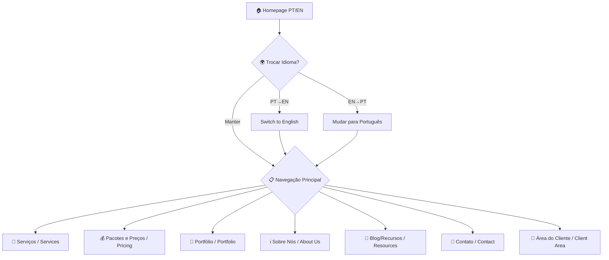

---

## 📋 Fluxo de Serviços

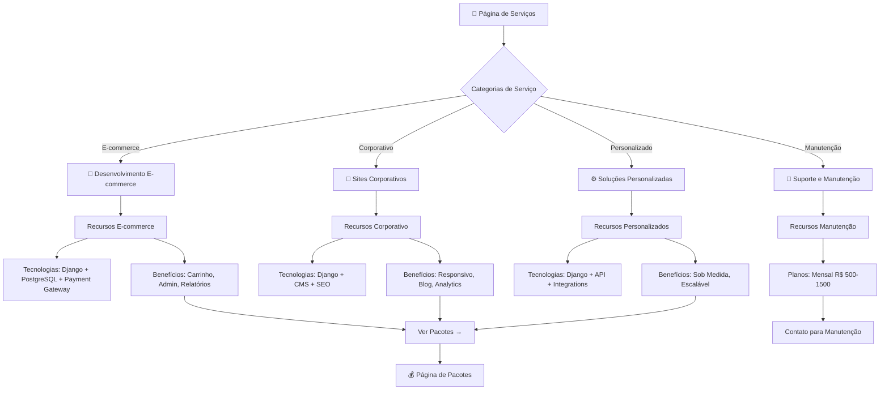

---

## 💰 Fluxo de Pacotes e Preços (João Pessoa Market)

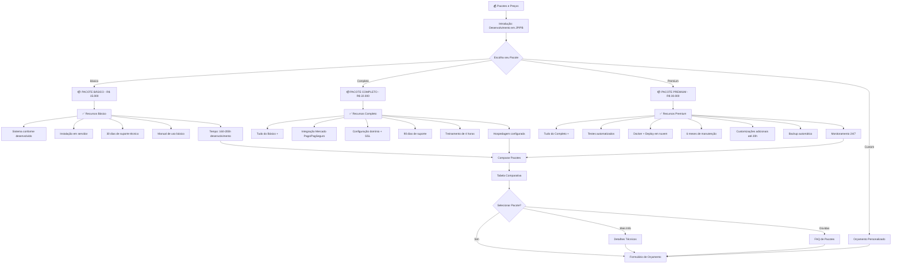

---

## 📝 Fluxo de Solicitação de Orçamento

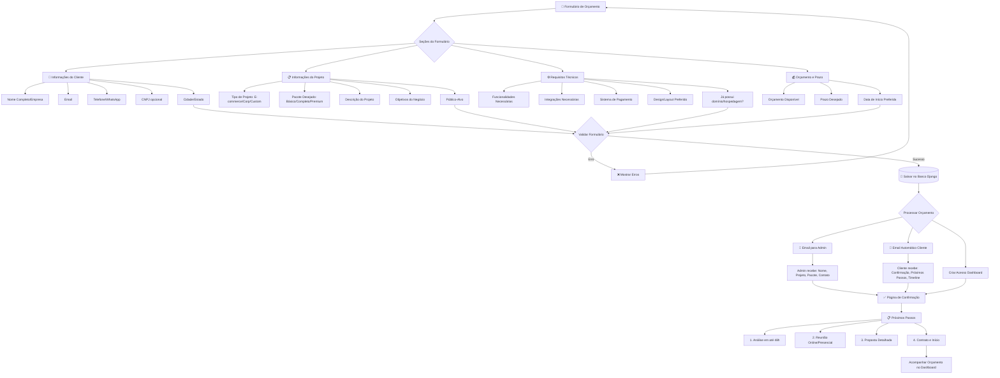

---

## 🎨 Fluxo de Portfólio

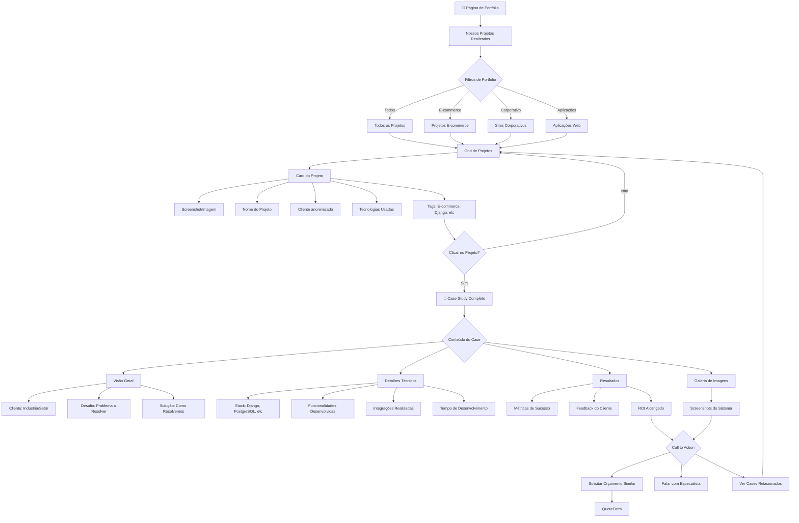

---

## 📝 Fluxo de Blog/Recursos

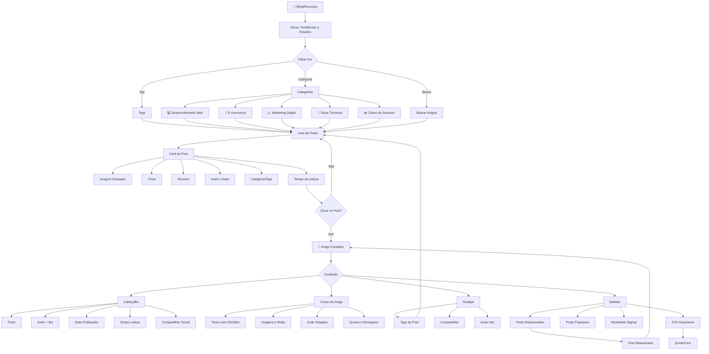

---

## 👤 Fluxo de Área do Cliente (Client Dashboard)

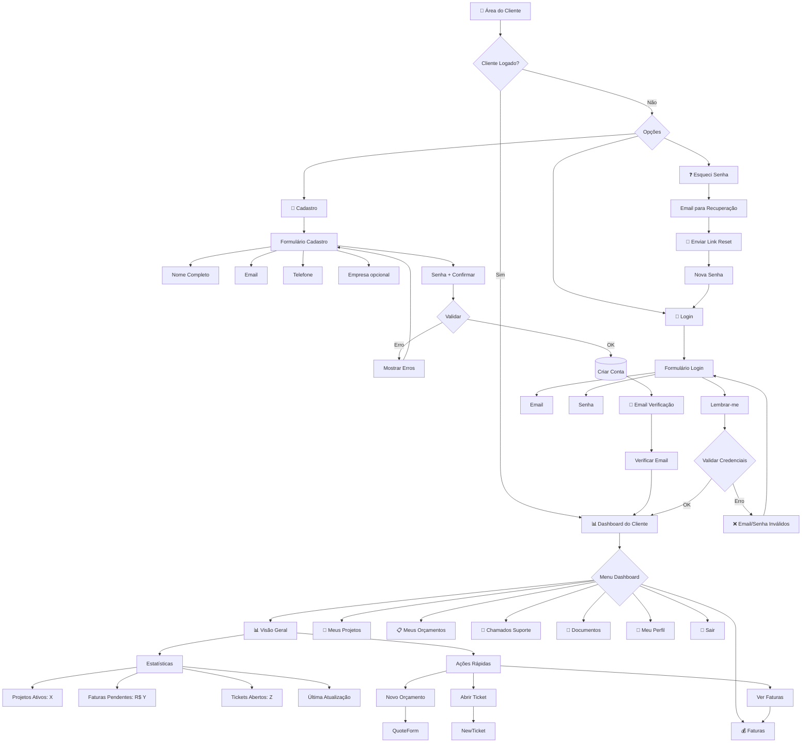

---

## 📁 Fluxo de Projetos do Cliente

```mermaid
graph TD
    MyProjects[📁 Meus Projetos] --> ProjectsList[Lista de Projetos]
    
    ProjectsList --> ProjectStatus{Filtrar por Status}
    
    ProjectStatus -->|Todos| AllProjects[Todos]
    ProjectStatus -->|Em Orçamento| QuoteStage[Em Análise]
    ProjectStatus -->|Aprovado| ApprovedProjects[Aprovados]
    ProjectStatus -->|Em Desenvolvimento| InProgress[Em Desenvolvimento]
    ProjectStatus -->|Em Testes| TestingStage[Em Testes]
    ProjectStatus -->|Concluído| Completed[Concluídos]
    ProjectStatus -->|Manutenção| Maintenance[Em Manutenção]
    
    AllProjects --> ProjectCard[Card do Projeto]
    InProgress --> ProjectCard
    TestingStage --> ProjectCard
    Completed --> ProjectCard
    
    ProjectCard --> PC1[Nome do Projeto]
    ProjectCard --> PC2[Status Badge]
    ProjectCard --> PC3[Progresso %]
    ProjectCard --> PC4[Próximo Marco]
    ProjectCard --> PC5[Última Atualização]
    
    PC5 --> ClickProject{Ver Detalhes?}
    
    ClickProject -->|Sim| ProjectDetail[📄 Detalhes do Projeto]
    ClickProject -->|Não| ProjectsList
    
    ProjectDetail --> ProjectTabs{Abas do Projeto}
    
    ProjectTabs --> TabOverview[Visão Geral]
    ProjectTabs --> TabMilestones[📍 Marcos/Milestones]
    ProjectTabs --> TabTimeline[📅 Linha do Tempo]
    ProjectTabs --> TabMessages[💬 Mensagens]
    ProjectTabs --> TabFiles[📎 Arquivos]
    ProjectTabs --> TabInvoices[💰 Faturas]
    
    TabOverview --> PO1[Descrição do Projeto]
    TabOverview --> PO2[Equipe Responsável]
    TabOverview --> PO3[Tecnologias Utilizadas]
    TabOverview --> PO4[Data Início/Previsão]
    TabOverview --> PO5[Barra de Progresso Geral]
    
    TabMilestones --> MilestoneList[Lista de Marcos]
    MilestoneList --> Milestone[Marco Individual]
    Milestone --> M1[Nome do Marco]
    Milestone --> M2[Descrição]
    Milestone --> M3[Status: Concluído/Pendente/Em Andamento]
    Milestone --> M4[Data Prevista/Conclusão]
    Milestone --> M5[✅ Checkbox Status]
    
    TabTimeline --> TimelineEvents[Eventos da Timeline]
    TimelineEvents --> Event[Evento]
    Event --> E1[Data e Hora]
    Event --> E2[Tipo: Update/Marco/Mensagem]
    Event --> E3[Descrição]
    Event --> E4[Responsável]
    
    TabMessages --> MessageThread[Thread de Mensagens]
    MessageThread --> Message[Mensagem]
    Message --> MSG1[Autor: Cliente/Dev/Admin]
    Message --> MSG2[Data e Hora]
    Message --> MSG3[Conteúdo]
    Message --> MSG4[Anexos]
    
    MessageThread --> NewMessage[✍️ Nova Mensagem]
    NewMessage --> SendMsg[Enviar Mensagem]
    SendMsg --> NotifyTeam[📧 Notificar Equipe]
    NotifyTeam --> MessageThread
    
    TabFiles --> FilesList[Lista de Arquivos]
    FilesList --> FileItem[Arquivo]
    FileItem --> FI1[Nome do Arquivo]
    FileItem --> FI2[Tipo: Design/Doc/Código]
    FileItem --> FI3[Tamanho]
    FileItem --> FI4[Data Upload]
    FileItem --> FI5[⬇️ Download]
    
    TabInvoices --> ProjectInvoices[Faturas do Projeto]
    ProjectInvoices --> InvoiceItem[Fatura]
    InvoiceItem --> II1[Número Fatura]
    InvoiceItem --> II2[Valor]
    InvoiceItem --> II3[Status: Pago/Pendente/Vencido]
    InvoiceItem --> II4[Data Vencimento]
    InvoiceItem --> II5[💳 Pagar Agora]
    
    II5 --> PaymentGateway[Gateway de Pagamento]
```

---

## 💰 Fluxo de Faturas e Pagamentos

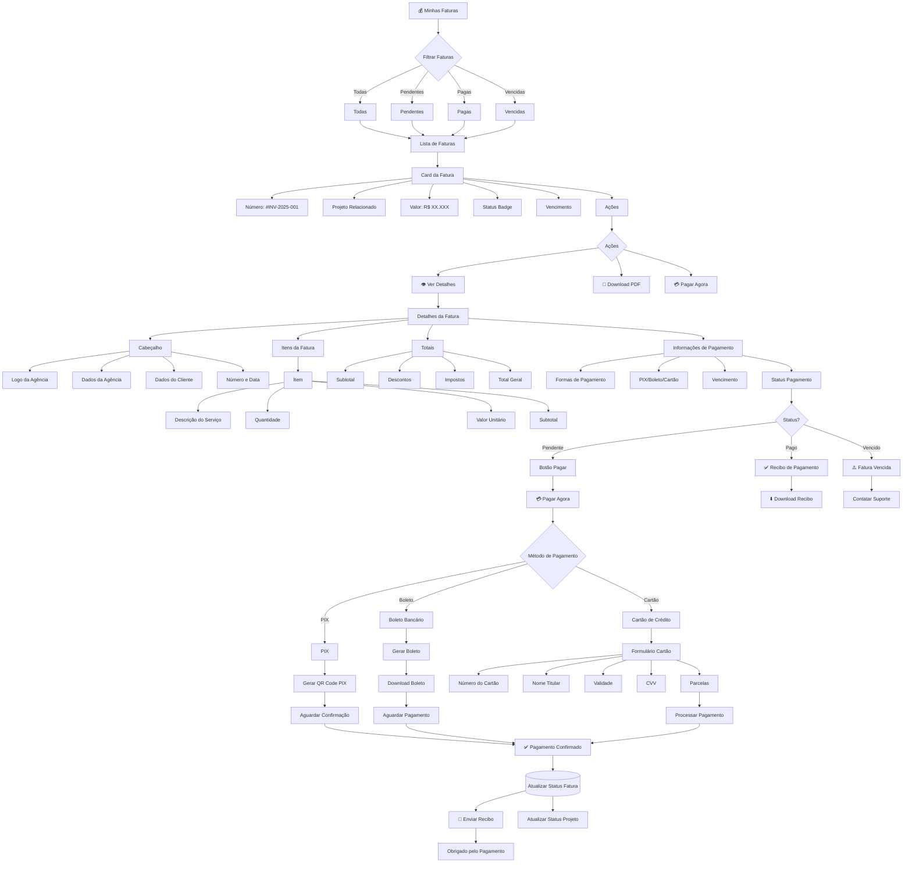

---

## 🎫 Fluxo de Suporte (Tickets)

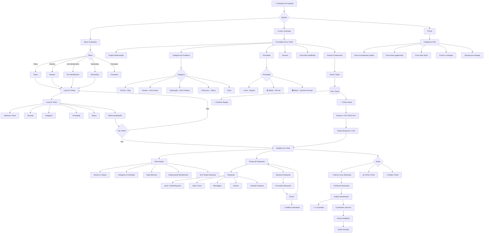

---

## 👤 Fluxo de Perfil do Cliente

```mermaid
graph TD
    Profile[👤 Meu Perfil] --> ProfileTabs{Abas do Perfil}
    
    ProfileTabs --> PersonalInfo[Informações Pessoais]
    ProfileTabs --> CompanyInfo[Dados da Empresa]
    ProfileTabs --> Security[Segurança]
    ProfileTabs --> Preferences[Preferências]
    ProfileTabs --> Notifications[Notificações]
    
    PersonalInfo --> PI[Dados Pessoais]
    PI --> PI1[Foto de Perfil]
    PI --> PI2[Nome Completo]
    PI --> PI3[Email]
    PI --> PI4[Telefone/WhatsApp]
    PI --> PI5[CPF]
    
    PI5 --> EditPersonal[✏️ Editar]
    EditPersonal --> UpdatePersonal[Atualizar Dados]
    UpdatePersonal --> SaveChanges[Salvar Alterações]
    
    CompanyInfo --> CI[Dados Empresariais]
    CI --> CI1[Nome da Empresa]
    CI --> CI2[CNPJ]
    CI --> CI3[Endereço Completo]
    CI --> CI4[Ramo de Atividade]
    CI --> CI5[Website]
    
    CI5 --> EditCompany[✏️ Editar]
    EditCompany --> UpdateCompany[Atualizar Dados]
    UpdateCompany --> SaveChanges
    
    Security --> SecOptions{Opções Segurança}
    
    SecOptions --> ChangePassword[🔐 Alterar Senha]
    SecOptions --> TwoFactor[2FA Autenticação]
    SecOptions --> LoginHistory[Histórico de Login]
    SecOptions --> ActiveSessions[Sessões Ativas]
    
    ChangePassword --> PassForm[Formulário Senha]
    PassForm --> PF1[Senha Atual]
    PassForm --> PF2[Nova Senha]
    PassForm --> PF3[Confirmar Nova Senha]
    
    PF3 --> ValidatePass{Validar}
    ValidatePass -->|Erro| PassError[Senha não atende requisitos]
    ValidatePass -->|OK| UpdatePassword[Atualizar Senha]
    UpdatePassword --> PassConfirm[✅ Senha Alterada]
    
    TwoFactor --> TwoFactorStatus{2FA Ativo?}
    TwoFactorStatus -->|Não| Enable2FA[Ativar 2FA]
    TwoFactorStatus -->|Sim| Disable2FA[Desativar 2FA]
    
    Enable2FA --> ScanQR[Escanear QR Code]
    ScanQR --> VerifyCode[Verificar Código]
    VerifyCode --> TwoFactorEnabled[✅ 2FA Ativado]
    
    LoginHistory --> HistoryList[Lista Histórico]
    HistoryList --> HI[Item Histórico]
    HI --> HI1[Data e Hora]
    HI --> HI2[IP Address]
    HI --> HI3[Dispositivo]
    HI --> HI4[Localização]
    HI --> HI5[Status: Sucesso/Falha]
    
    ActiveSessions --> SessionList[Sessões Ativas]
    SessionList --> SS[Sessão]
    SS --> SS1[Dispositivo]
    SS --> SS2[Navegador]
    SS --> SS3[IP]
    SS --> SS4[Último Acesso]
    SS --> SS5[❌ Encerrar]
    
    Preferences --> PrefOptions{Preferências}
    
    PrefOptions --> Language[🌍 Idioma]
    PrefOptions --> Timezone[🕐 Fuso Horário]
    PrefOptions --> DateFormat[📅 Formato Data]
    PrefOptions --> Currency[💰 Moeda]
    
    Language --> LangChoice{Escolher Idioma}
    LangChoice -->|PT| PortugueseLang[Português BR]
    LangChoice -->|EN| EnglishLang[English US]
    
    Notifications --> NotifSettings{Configurar Notificações}
    
    NotifSettings --> EmailNotif[📧 Email]
    NotifSettings --> SMSNotif[📱 SMS]
    NotifSettings --> PushNotif[🔔 Push]
    
    EmailNotif --> EmailTypes[Tipos de Email]
    EmailTypes --> ET1[Atualizações Projeto]
    EmailTypes --> ET2[Novas Faturas]
    EmailTypes --> ET3[Resposta Ticket]
    EmailTypes --> ET4[Newsletter]
    EmailTypes --> ET5[Marketing]
    
    ET5 --> ToggleNotif[Ativar/Desativar]
    ToggleNotif --> SaveChanges
```

---

## 🔧 Fluxo Administrativo (Admin/Staff)

```mermaid
graph TD
    AdminAccess[🔧 Painel Administrativo] --> AdminAuth{Staff/Superuser?}
    
    AdminAuth -->|Não| AccessDenied[❌ Acesso Negado]
    AdminAuth -->|Sim| AdminDashboard[📊 Dashboard Admin]
    
    AdminDashboard --> AdminMenu{Menu Admin}
    
    AdminMenu --> ManageQuotes[📋 Gerenciar Orçamentos]
    AdminMenu --> ManageProjects[📁 Gerenciar Projetos]
    AdminMenu --> ManageClients[👥 Gerenciar Clientes]
    AdminMenu --> ManageInvoices[💰 Gerenciar Faturas]
    AdminMenu --> ManageTickets[🎫 Gerenciar Tickets]
    AdminMenu --> ManageBlog[📝 Gerenciar Blog]
    AdminMenu --> ManagePortfolio[🎨 Gerenciar Portfólio]
    AdminMenu --> ManagePackages[💼 Gerenciar Pacotes]
    AdminMenu --> ManageUsers[👤 Gerenciar Usuários]
    AdminMenu --> SiteSettings[⚙️ Configurações]
    AdminMenu --> Reports[📊 Relatórios]
    
    ManageQuotes --> QuoteList[Lista de Orçamentos]
    QuoteList --> QuoteFilters{Filtrar}
    QuoteFilters -->|Novos| NewQuotes[Novos não lidos]
    QuoteFilters -->|Em Análise| AnalysisQuotes[Em análise]
    QuoteFilters -->|Aprovados| ApprovedQuotes[Aprovados]
    QuoteFilters -->|Rejeitados| RejectedQuotes[Rejeitados]
    
    NewQuotes --> QuoteAdmin[Ver Orçamento]
    
    QuoteAdmin --> QuoteDetails[Detalhes Completos]
    QuoteDetails --> QD1[Dados do Cliente]
    QuoteDetails --> QD2[Tipo de Projeto]
    QuoteDetails --> QD3[Pacote Escolhido]
    QuoteDetails --> QD4[Orçamento Cliente]
    QuoteDetails --> QD5[Prazo Desejado]
    QuoteDetails --> QD6[Descrição Detalhada]
    
    QD6 --> QuoteActions{Ações Admin}
    
    QuoteActions --> AnalyzeQuote[🔍 Analisar]
    QuoteActions --> ApproveQuote[✅ Aprovar]
    QuoteActions --> RejectQuote[❌ Rejeitar]
    QuoteActions --> RequestInfo[ℹ️ Solicitar Mais Info]
    QuoteActions --> ScheduleMeeting[📅 Agendar Reunião]
    
    ApproveQuote --> ConvertToProject[Converter em Projeto]
    ConvertToProject --> CreateProject[(Criar Projeto)]
    CreateProject --> AssignTeam[Atribuir Equipe]
    CreateProject --> CreateInvoice[Criar Fatura Inicial]
    CreateProject --> NotifyClientApproval[📧 Notificar Cliente]
    
    RejectQuote --> RejectionReason[Motivo Rejeição]
    RejectionReason --> NotifyClientReject[📧 Notificar Cliente]
    
    ManageProjects --> ProjectListAdmin[Lista Projetos]
    ProjectListAdmin --> ProjectStatusFilter{Status}
    ProjectStatusFilter -->|Em Desenvolvimento| DevProjects
    ProjectStatusFilter -->|Em Testes| TestProjects
    ProjectStatusFilter -->|Atrasados| DelayedProjects
    ProjectStatusFilter -->|Concluídos| CompletedProjects
    
    DevProjects --> ProjectAdminView[Ver Projeto Admin]
    
    ProjectAdminView --> ProjectAdminTabs{Abas Admin}
    
    ProjectAdminTabs --> AdminOverview[Visão Geral]
    ProjectAdminTabs --> AdminTeam[Equipe]
    ProjectAdminTabs --> AdminTimeline[Timeline]
    ProjectAdminTabs --> AdminFiles[Arquivos]
    ProjectAdminTabs --> AdminBilling[Faturamento]
    
    AdminOverview --> UpdateStatus[Atualizar Status]
    AdminOverview --> UpdateProgress[Atualizar Progresso %]
    AdminOverview --> AddMilestone[Adicionar Marco]
    AdminOverview --> EditDetails[Editar Detalhes]
    
    AdminTeam --> TeamMembers[Membros Equipe]
    TeamMembers --> TM1[Developer Principal]
    TeamMembers --> TM2[Frontend Dev]
    TeamMembers --> TM3[Designer]
    TeamMembers --> TM4[Project Manager]
    
    TeamMembers --> AssignMember[Atribuir Membro]
    TeamMembers --> RemoveMember[Remover Membro]
    
    AdminTimeline --> AddUpdate[Adicionar Atualização]
    AddUpdate --> UpdateType{Tipo}
    UpdateType --> TypeMilestone[Marco Concluído]
    UpdateType --> TypeProgress[Progresso]
    UpdateType --> TypeIssue[Problema]
    UpdateType --> TypeMeeting[Reunião]
    
    AdminBilling --> CreateNewInvoice[Criar Nova Fatura]
    AdminBilling --> EditInvoice[Editar Fatura]
    AdminBilling --> SendInvoice[Enviar Fatura]
    
    ManageClients --> ClientListAdmin[Lista de Clientes]
    ClientListAdmin --> ClientAdmin[Ver Cliente]
    
    ClientAdmin --> ClientAdminInfo{Informações}
    
    ClientAdminInfo --> ClientProfile[Perfil Completo]
    ClientAdminInfo --> ClientProjects[Projetos do Cliente]
    ClientAdminInfo --> ClientInvoices[Faturas do Cliente]
    ClientAdminInfo --> ClientTickets[Tickets do Cliente]
    ClientAdminInfo --> ClientNotes[Notas Internas]
    
    ClientProfile --> EditClient[Editar Cliente]
    ClientNotes --> AddNote[Adicionar Nota]
    
    ManageInvoices --> InvoiceListAdmin[Lista Faturas Admin]
    InvoiceListAdmin --> InvoiceStatusAdmin{Status}
    InvoiceStatusAdmin -->|Pendentes| PendingAdmin
    InvoiceStatusAdmin -->|Vencidas| OverdueAdmin
    InvoiceStatusAdmin -->|Pagas| PaidAdmin
    
    PendingAdmin --> InvoiceAdminView[Ver Fatura]
    
    InvoiceAdminView --> InvoiceAdminActions{Ações}
    InvoiceAdminActions --> EditInvoiceAdmin[Editar]
    InvoiceAdminActions --> MarkAsPaid[Marcar como Paga]
    InvoiceAdminActions --> SendReminder[Enviar Lembrete]
    InvoiceAdminActions --> CancelInvoice[Cancelar Fatura]
    
    ManageTickets --> TicketListAdmin[Lista Tickets Admin]
    TicketListAdmin --> TicketPriority{Prioridade}
    TicketPriority -->|Alta| HighPriority
    TicketPriority -->|Média| MediumPriority
    TicketPriority -->|Baixa| LowPriority
    
    HighPriority --> TicketAdminView[Ver Ticket]
    
    TicketAdminView --> TicketAdminActions{Ações Admin}
    TicketAdminActions --> AssignAgent[Atribuir Atendente]
    TicketAdminActions --> ChangePriority[Mudar Prioridade]
    TicketAdminActions --> ChangeCategory[Mudar Categoria]
    TicketAdminActions --> ReplyTicket[Responder]
    TicketAdminActions --> ResolveTicket[Resolver]
    TicketAdminActions --> CloseTicketAdmin[Fechar]
    
    ManageBlog --> BlogAdmin{Blog Admin}
    
    BlogAdmin --> BlogPosts[Posts Publicados]
    BlogAdmin --> BlogDrafts[Rascunhos]
    BlogAdmin --> BlogCategories[Categorias]
    BlogAdmin --> BlogTags[Tags]
    BlogAdmin --> NewBlogPost[➕ Novo Post]
    
    NewBlogPost --> BlogEditor[Editor CKEditor]
    BlogEditor --> BE1[Título PT/EN]
    BlogEditor --> BE2[Slug URL]
    BlogEditor --> BE3[Conteúdo PT/EN]
    BlogEditor --> BE4[Imagem Destaque]
    BlogEditor --> BE5[Categoria]
    BlogEditor --> BE6[Tags]
    BlogEditor --> BE7[SEO Meta]
    
    BE7 --> BlogActions{Ações Post}
    BlogActions --> SaveDraft[Salvar Rascunho]
    BlogActions --> PublishPost[Publicar]
    BlogActions --> SchedulePost[Agendar Publicação]
    
    ManagePortfolio --> PortfolioAdmin{Portfólio Admin}
    
    PortfolioAdmin --> PortfolioCases[Cases Publicados]
    PortfolioAdmin --> NewCase[➕ Novo Case]
    
    NewCase --> CaseForm[Formulário Case]
    CaseForm --> CF1[Título Projeto PT/EN]
    CaseForm --> CF2[Cliente anonimizado]
    CaseForm --> CF3[Categoria]
    CaseForm --> CF4[Descrição PT/EN]
    CaseForm --> CF5[Desafio PT/EN]
    CaseForm --> CF6[Solução PT/EN]
    CaseForm --> CF7[Resultados PT/EN]
    CaseForm --> CF8[Tecnologias]
    CaseForm --> CF9[Screenshots]
    CaseForm --> CF10[Destaque? Sim/Não]
    
    CF10 --> SaveCase[Salvar Case]
    SaveCase --> CasePublished[✅ Case Publicado]
    
    ManagePackages --> PackagesAdmin[Gerenciar Pacotes]
    PackagesAdmin --> PackageList[Lista Pacotes]
    PackageList --> EditPackage[Editar Pacote]
    
    EditPackage --> PackageForm[Formulário Pacote]
    PackageForm --> PKF1[Nome PT/EN]
    PackageForm --> PKF2[Preço R$]
    PackageForm --> PKF3[Descrição PT/EN]
    PackageForm --> PKF4[Recursos Inclusos PT/EN]
    PackageForm --> PKF5[Duração Suporte]
    PackageForm --> PKF6[Ordem Exibição]
    PackageForm --> PKF7[Ativo/Inativo]
    
    PKF7 --> SavePackage[Salvar Pacote]
    
    SiteSettings --> Settings{Configurações}
    
    Settings --> GeneralSettings[Gerais]
    Settings --> EmailSettings[Email/SMTP]
    Settings --> PaymentSettings[Pagamentos]
    Settings --> SEOSettings[SEO]
    Settings --> SocialSettings[Redes Sociais]
    
    GeneralSettings --> GS1[Nome Site PT/EN]
    GeneralSettings --> GS2[Tagline PT/EN]
    GeneralSettings --> GS3[Logo]
    GeneralSettings --> GS4[Favicon]
    GeneralSettings --> GS5[Endereço Empresa]
    GeneralSettings --> GS6[Telefone/WhatsApp]
    GeneralSettings --> GS7[Horário Atendimento]
    
    EmailSettings --> ES1[SMTP Host]
    EmailSettings --> ES2[SMTP Port]
    EmailSettings --> ES3[Email Remetente]
    EmailSettings --> ES4[Templates Email PT/EN]
    
    PaymentSettings --> PS1[Gateway: Mercado Pago]
    PaymentSettings --> PS2[Access Token]
    PaymentSettings --> PS3[Public Key]
    PaymentSettings --> PS4[Webhook URL]
    
    Reports --> ReportTypes{Tipo Relatório}
    
    ReportTypes --> SalesReport[Vendas/Faturamento]
    ReportTypes --> ProjectsReport[Projetos]
    ReportTypes --> ClientsReport[Clientes]
    ReportTypes --> TicketsReport[Suporte]
    
    SalesReport --> SalesFilters[Filtros]
    SalesFilters --> SF1[Período]
    SalesFilters --> SF2[Pacote]
    SalesFilters --> SF3[Status Pagamento]
    
    SF3 --> GenerateReport[Gerar Relatório]
    GenerateReport --> ReportView[Visualizar]
    GenerateReport --> ExportPDF[Exportar PDF]
    GenerateReport --> ExportExcel[Exportar Excel]
```

---

## 🌍 Sistema de Tradução (i18n)

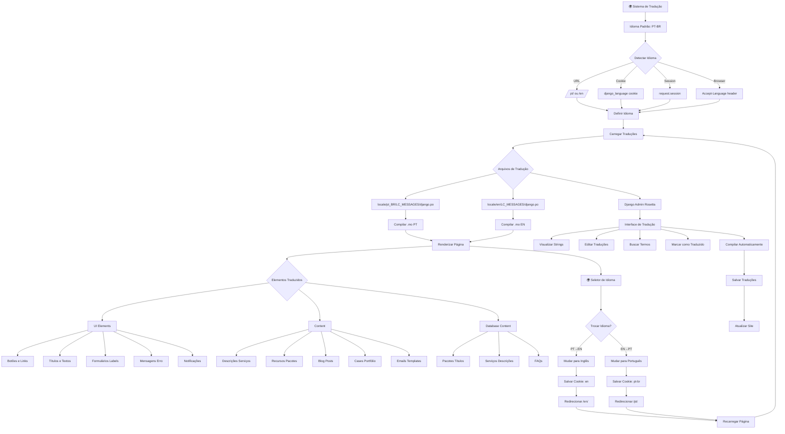

---

## 📧 Sistema de Emails e Notificações

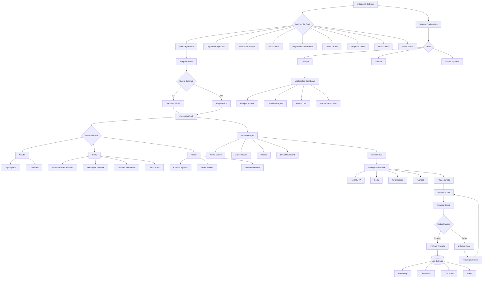

---

## 🔒 Sistema de Autenticação e Segurança

```mermaid
graph TD
    Security[🔒 Sistema de Segurança] --> AuthSystem[Autenticação]
    
    AuthSystem --> LoginProcess[Processo de Login]
    
    LoginProcess --> EnterCredentials[Email + Senha]
    EnterCredentials --> ValidateInput{Validar Input}
    
    ValidateInput -->|Erro| InputError[Erro Validação]
    InputError --> EnterCredentials
    
    ValidateInput -->|OK| CheckUser[(Buscar Usuário)]
    
    CheckUser --> UserExists{Usuário Existe?}
    
    UserExists -->|Não| InvalidLogin[Login Inválido]
    UserExists -->|Sim| CheckPassword[Verificar Senha Hash]
    
    CheckPassword --> PasswordMatch{Senha Correta?}
    
    PasswordMatch -->|Não| LogFailedAttempt[Registrar Tentativa Falha]
    LogFailedAttempt --> CheckAttempts{Muitas Tentativas?}
    
    CheckAttempts -->|Sim| BlockAccount[Bloquear Temporariamente]
    BlockAttempts --> NotifyBlock[Email Bloqueio]
    
    CheckAttempts -->|Não| InvalidLogin
    InvalidLogin --> LoginProcess
    
    PasswordMatch -->|Sim| Check2FA{2FA Ativo?}
    
    Check2FA -->|Não| CreateSession[Criar Sessão]
    Check2FA -->|Sim| Require2FA[Solicitar Código 2FA]
    
    Require2FA --> Enter2FA[Digitar Código]
    Enter2FA --> Verify2FA{Código Válido?}
    
    Verify2FA -->|Não| Invalid2FA[Código Inválido]
    Invalid2FA --> Require2FA
    
    Verify2FA -->|Sim| CreateSession
    
    CreateSession --> SessionData[Dados Sessão]
    SessionData --> SD1[User ID]
    SessionData --> SD2[Timestamp]
    SessionData --> SD3[IP Address]
    SessionData --> SD4[User Agent]
    SessionData --> SD5[Session Token]
    
    SessionData --> SetCookies[Definir Cookies]
    SetCookies --> C1[sessionid Cookie]
    SetCookies --> C2[CSRF Token]
    SetCookies --> C3[Language Preference]
    
    SetCookies --> LogLogin[(Log Login)]
    LogLogin --> LL1[Timestamp]
    LogLogin --> LL2[IP]
    LogLogin --> LL3[Dispositivo]
    LogLogin --> LL4[Localização estimada]
    
    LogLogin --> RedirectDashboard[Redirecionar Dashboard]
    
    Security --> PasswordSecurity[Segurança de Senha]
    
    PasswordSecurity --> PasswordRequirements[Requisitos]
    PasswordRequirements --> PR1[Mínimo 8 caracteres]
    PasswordRequirements --> PR2[Letra maiúscula]
    PasswordRequirements --> PR3[Letra minúscula]
    PasswordRequirements --> PR4[Número]
    PasswordRequirements --> PR5[Caractere especial]
    
    PasswordSecurity --> PasswordHashing[Hash de Senha]
    PasswordHashing --> PH1[Algoritmo: PBKDF2]
    PasswordHashing --> PH2[Salt aleatório]
    PasswordHashing --> PH3[Iterations: 390000]
    
    Security --> SessionManagement[Gestão de Sessões]
    
    SessionManagement --> SessionExpiry[Expiração]
    SessionExpiry --> SE1[Inatividade: 2 semanas]
    SessionExpiry --> SE2[Absoluto: 4 semanas]
    
    SessionManagement --> MultipleDevices[Múltiplos Dispositivos]
    MultipleDevices --> MD1[Lista Sessões Ativas]
    MultipleDevices --> MD2[Encerrar Sessão Remota]
    MultipleDevices --> MD3[Encerrar Todas Sessões]
    
    Security --> CSRFProtection[Proteção CSRF]
    
    CSRFProtection --> CSRF1[Token em Formulários]
    CSRFProtection --> CSRF2[Verificar em POST]
    CSRFProtection --> CSRF3[Rejeitar sem Token]
    
    Security --> Permissions[Permissões]
    
    Permissions --> UserRoles{Níveis de Acesso}
    
    UserRoles --> ClientRole[Cliente]
    UserRoles --> StaffRole[Staff]
    UserRoles --> AdminRole[Admin]
    UserRoles --> SuperuserRole[Superuser]
    
    ClientRole --> ClientPerms[Permissões Cliente]
    ClientPerms --> CP1[Ver próprios projetos]
    ClientPerms --> CP2[Ver próprias faturas]
    ClientPerms --> CP3[Criar tickets]
    ClientPerms --> CP4[Editar perfil]
    
    StaffRole --> StaffPerms[Permissões Staff]
    StaffPerms --> SP1[Ver todos projetos]
    StaffPerms --> SP2[Atualizar projetos]
    StaffPerms --> SP3[Responder tickets]
    StaffPerms --> SP4[Criar faturas]
    
    AdminRole --> AdminPerms[Permissões Admin]
    AdminPerms --> AP1[Todas Staff +]
    AdminPerms --> AP2[Gerenciar clientes]
    AdminPerms --> AP3[Gerenciar blog]
    AdminPerms --> AP4[Gerenciar portfólio]
    AdminPerms --> AP5[Configurações site]
    
    SuperuserRole --> SuperPerms[Permissões Superuser]
    SuperPerms --> SUP1[Todas permissões]
    SuperPerms --> SUP2[Django Admin completo]
    SuperPerms --> SUP3[Gerenciar usuários staff]
```

---

## 📱 Fluxo Responsivo Mobile

```mermaid
graph TD
    Mobile[📱 Acesso Mobile] --> DetectDevice{Detectar Dispositivo}
    
    DetectDevice -->|Desktop| DesktopView[Layout Desktop]
    DetectDevice -->|Tablet| TabletView[Layout Tablet]
    DetectDevice -->|Mobile| MobileView[Layout Mobile]
    
    MobileView --> MobileNav[Navegação Mobile]
    
    MobileNav --> Hamburger[☰ Menu Hamburger]
    Hamburger --> MenuOpen{Menu Aberto?}
    
    MenuOpen -->|Não| ShowHamburger[Mostrar Ícone]
    MenuOpen -->|Sim| SlideMenu[Slide Menu]
    
    SlideMenu --> MobileMenuItems[Itens Menu]
    MobileMenuItems --> MI1[Início]
    MobileMenuItems --> MI2[Serviços]
    MobileMenuItems --> MI3[Pacotes]
    MobileMenuItems --> MI4[Portfólio]
    MobileMenuItems --> MI5[Blog]
    MobileMenuItems --> MI6[Contato]
    MobileMenuItems --> MI7[Área Cliente]
    MobileMenuItems --> MI8[🌍 Idioma]
    
    MI8 --> CloseMenu[Fechar Menu]
    
    MobileView --> TouchOptimized[Otimizado Touch]
    TouchOptimized --> TO1[Botões maiores 44px+]
    TouchOptimized --> TO2[Espaçamento adequado]
    TouchOptimized --> TO3[Swipe gestures]
    TouchOptimized --> TO4[Formulários mobile-friendly]
    
    MobileView --> MobileFeatures[Features Mobile]
    MobileFeatures --> MF1[Click-to-call telefone]
    MobileFeatures --> MF2[WhatsApp direto]
    MobileFeatures --> MF3[Geolocalização]
    MobileFeatures --> MF4[Camera para upload]
    
    MobileView --> MobilePerformance[Performance]
    MobilePerformance --> MP1[Lazy loading imagens]
    MobilePerformance --> MP2[CSS/JS minificado]
    MobilePerformance --> MP3[Cache agressivo]
    MobilePerformance --> MP4[PWA capable]
```

---

## 🎯 Conversão e Analytics

```mermaid
graph TD
    Analytics[📊 Analytics & Conversão] --> TrackingSetup[Setup Tracking]
    
    TrackingSetup --> GoogleAnalytics[Google Analytics 4]
    TrackingSetup --> FacebookPixel[Facebook Pixel]
    TrackingSetup --> HotjarOptional[Hotjar opcional]
    
    GoogleAnalytics --> GAEvents[Eventos GA4]
    
    GAEvents --> PageViews[Pageviews]
    GAEvents --> UserActions[Ações Usuário]
    
    UserActions --> UA1[quote_form_started]
    UserActions --> UA2[quote_form_submitted]
    UserActions --> UA3[package_viewed]
    UserActions --> UA4[portfolio_case_viewed]
    UserActions --> UA5[blog_post_read]
    UserActions --> UA6[contact_form_submitted]
    UserActions --> UA7[client_login]
    UserActions --> UA8[invoice_paid]
    
    Analytics --> ConversionFunnels[Funis de Conversão]
    
    ConversionFunnels --> Funnel1[Funil Orçamento]
    Funnel1 --> F1S1[Homepage]
    Funnel1 --> F1S2[Página Pacotes]
    Funnel1 --> F1S3[Formulário Orçamento]
    Funnel1 --> F1S4[Confirmação]
    
    ConversionFunnels --> Funnel2[Funil Blog→Lead]
    Funnel2 --> F2S1[Blog Post]
    Funnel2 --> F2S2[CTA no Post]
    Funnel2 --> F2S3[Formulário]
    Funnel2 --> F2S4[Lead Gerado]
    
    ConversionFunnels --> Funnel3[Funil Portfolio→Lead]
    Funnel3 --> F3S1[Portfólio]
    Funnel3 --> F3S2[Case Study]
    Funnel3 --> F3S3[Solicitar Orçamento]
    Funnel3 --> F3S4[Lead Gerado]
    
    Analytics --> ABTesting[A/B Testing]
    ABTesting --> AB1[CTA Buttons Text]
    ABTesting --> AB2[Package Pricing Display]
    ABTesting --> AB3[Form Length]
    ABTesting --> AB4[Homepage Hero]
    
    Analytics --> Dashboards[Dashboards Analytics]
    
    Dashboards --> BusinessDash[Dashboard Negócio]
    BusinessDash --> BD1[Leads Mês]
    BusinessDash --> BD2[Taxa Conversão]
    BusinessDash --> BD3[Receita Mês]
    BusinessDash --> BD4[Projetos Ativos]
    BusinessDash --> BD5[Ticket SLA]
    
    Dashboards --> MarketingDash[Dashboard Marketing]
    MarketingDash --> MD1[Tráfego Orgânico]
    MarketingDash --> MD2[Fontes Tráfego]
    MarketingDash --> MD3[Posts Populares]
    MarketingDash --> MD4[Landing Pages Performance]
    
    Analytics --> Reports[Relatórios Automáticos]
    Reports --> WeeklyReport[Relatório Semanal]
    Reports --> MonthlyReport[Relatório Mensal]
    Reports --> QuarterlyReport[Relatório Trimestral]
```

---

## 🔐 REST API Security & Authentication

```mermaid
graph TD
    API[🔌 REST API - ECOMMDEV.COM.BR/api/] --> APIAuth{Authentication Required?}
    
    APIAuth -->|Public| PublicEndpoints[Public Endpoints]
    APIAuth -->|Protected| ProtectedEndpoints[Protected Endpoints]
    
    PublicEndpoints --> PE1[GET /api/servicos/]
    PublicEndpoints --> PE2[GET /api/pacotes/]
    PublicEndpoints --> PE3[GET /api/portfolio/]
    PublicEndpoints --> PE4[GET /api/blog/posts/]
    PublicEndpoints --> PE5[POST /api/orcamentos/]
    PublicEndpoints --> PE6[POST /api/contato/]
    
    ProtectedEndpoints --> AuthMethod{Auth Method}
    
    AuthMethod --> JWTAuth[JWT Token Authentication]
    AuthMethod --> SessionAuth[Session Authentication]
    AuthMethod --> APIKeyAuth[API Key opcional]
    
    JWTAuth --> LoginEndpoint[POST /api/auth/login/]
    
    LoginEndpoint --> Credentials[Email + Password]
    Credentials --> ValidateCredentials{Valid?}
    
    ValidateCredentials -->|No| Unauthorized[401 Unauthorized]
    ValidateCredentials -->|Yes| GenerateTokens[Generate Tokens]
    
    GenerateTokens --> TokenPair[Token Pair]
    TokenPair --> AccessToken[Access Token - 60 min]
    TokenPair --> RefreshToken[Refresh Token - 7 days]
    
    AccessToken --> ReturnTokens[Return JSON Response]
    RefreshToken --> ReturnTokens
    
    ReturnTokens --> TokenResponse["{\n  'access': 'eyJ0eXAi...',\n  'refresh': 'eyJ0eXAi...'\n}"]
    
    TokenResponse --> UseToken[Use Access Token]
    
    UseToken --> APIRequest[API Request]
    APIRequest --> AuthHeader[Header: Authorization: Bearer token]
    
    AuthHeader --> ValidateToken{Token Valid?}
    
    ValidateToken -->|Expired| TokenExpired[401 Token Expired]
    ValidateToken -->|Invalid| InvalidToken[401 Invalid Token]
    ValidateToken -->|Valid| CheckPermissions{Check Permissions}
    
    TokenExpired --> RefreshEndpoint[POST /api/auth/refresh/]
    RefreshEndpoint --> SendRefreshToken[Send Refresh Token]
    SendRefreshToken --> NewAccessToken[New Access Token]
    NewAccessToken --> UseToken
    
    CheckPermissions -->|Allowed| ProcessRequest[Process Request]
    CheckPermissions -->|Denied| Forbidden[403 Forbidden]
    
    ProcessRequest --> APIResponse[API Response]
    
    APIResponse --> ResponseFormat{Response Format}
    
    ResponseFormat --> SuccessResponse[200 OK]
    ResponseFormat --> CreatedResponse[201 Created]
    ResponseFormat --> ErrorResponse[4xx/5xx Error]
    
    API --> ProtectedEndpointsDetail[Protected API Endpoints]
    
    ProtectedEndpointsDetail --> ClientAPI[Client Endpoints]
    ClientAPI --> CA1[GET /api/clientes/me/]
    ClientAPI --> CA2[PUT /api/clientes/me/]
    ClientAPI --> CA3[GET /api/projetos/]
    ClientAPI --> CA4[GET /api/projetos/:id/]
    ClientAPI --> CA5[POST /api/projetos/:id/mensagens/]
    ClientAPI --> CA6[GET /api/faturas/]
    ClientAPI --> CA7[GET /api/faturas/:id/]
    ClientAPI --> CA8[POST /api/faturas/:id/pagar/]
    ClientAPI --> CA9[GET /api/tickets/]
    ClientAPI --> CA10[POST /api/tickets/]
    
    ProtectedEndpointsDetail --> StaffAPI[Staff/Admin Endpoints]
    StaffAPI --> SA1[GET /api/admin/orcamentos/]
    StaffAPI --> SA2[PUT /api/admin/orcamentos/:id/]
    StaffAPI --> SA3[POST /api/admin/projetos/]
    StaffAPI --> SA4[PUT /api/admin/projetos/:id/]
    StaffAPI --> SA5[POST /api/admin/faturas/]
    StaffAPI --> SA6[GET /api/admin/clientes/]
    
    API --> APISecurity[Security Measures]
    
    APISecurity --> CORS[CORS Configuration]
    CORS --> AllowedOrigins[Allowed Origins]
    AllowedOrigins --> AO1[https://www.ecommdev.com.br]
    AllowedOrigins --> AO2[https://app.ecommdev.com.br]
    AllowedOrigins --> AO3[http://localhost:3000]
    
    APISecurity --> RateLimiting[Rate Limiting]
    RateLimiting --> RL1[Public: 100 req/hour]
    RateLimiting --> RL2[Authenticated: 1000 req/hour]
    RateLimiting --> RL3[Staff: 5000 req/hour]
    
    APISecurity --> InputValidation[Input Validation]
    InputValidation --> IV1[Django REST Serializers]
    InputValidation --> IV2[Field Validators]
    InputValidation --> IV3[Sanitization]
    
    APISecurity --> SQLInjection[SQL Injection Protection]
    SQLInjection --> SI1[Django ORM Parameterized]
    
    APISecurity --> XSS[XSS Protection]
    XSS --> XS1[Auto-escape Templates]
    XSS --> XS2[CSP Headers]
    
    APISecurity --> HTTPS[HTTPS Only]
    HTTPS --> SSL1[SSL Certificate]
    HTTPS --> SSL2[Force HTTPS]
    HTTPS --> SSL3[HSTS Header]
    
    API --> APIVersioning[API Versioning]
    APIVersioning --> V1[/api/v1/]
    APIVersioning --> V2[/api/v2/ future]
    
    API --> APIDocs[API Documentation]
    APIDocs --> Swagger[Swagger/OpenAPI /api/docs/]
    APIDocs --> Redoc[ReDoc /api/redoc/]
```

---

## 🗄️ PostgreSQL Database Architecture

```mermaid
graph TD
    PostgreSQL[(🐘 PostgreSQL\nECOMMDEV_DB)] --> DBTables{Database Tables}
    
    DBTables --> UserTables[User & Auth]
    DBTables --> CoreTables[Core Business]
    DBTables --> ContentTables[Content]
    DBTables --> TransactionTables[Transactions]
    DBTables --> LogTables[Logs & Audit]
    
    UserTables --> UT1[auth_user]
    UserTables --> UT2[clientes_cliente]
    UserTables --> UT3[clientes_perfil]
    
    UT1 --> UF1[id, username, email,\npassword, is_staff,\ndate_joined]
    
    UT2 --> UF2[id, user_id FK,\nnome_completo, telefone,\ncpf, created_at]
    
    UT3 --> UF3[id, cliente_id FK,\nempresa, cnpj,\nendereco, cidade]
    
    CoreTables --> CT1[servicos_servico]
    CoreTables --> CT2[pacotes_pacote]
    CoreTables --> CT3[orcamentos_orcamento]
    CoreTables --> CT4[projetos_projeto]
    
    CT1 --> CF1[id, nome_pt, nome_en,\nslug, descricao_pt,\ndescricao_en, ativo]
    
    CT2 --> CF2[id, nome_pt, nome_en,\npreco DECIMAL,\nrecursos_pt JSONB,\nrecursos_en JSONB]
    
    CT3 --> CF3[id, cliente_id FK,\npacote_id FK,\ntipo_projeto, status,\ndata_solicitacao]
    
    CT4 --> CF4[id, cliente_id FK,\nnome, status,\nprogresso INT,\ntecnologias JSONB]
    
    ContentTables --> ContT1[portfolio_case]
    ContentTables --> ContT2[blog_post]
    ContentTables --> ContT3[blog_categoria]
    
    ContT1 --> ContF1[id, titulo_pt, titulo_en,\ndesafio_pt, solucao_pt,\ntecnologias JSONB]
    
    ContT2 --> ContF2[id, autor_id FK,\ntitulo_pt, conteudo_pt,\nvisualizacoes INT]
    
    TransactionTables --> TT1[faturas_fatura]
    TransactionTables --> TT2[faturas_pagamento]
    TransactionTables --> TT3[suporte_ticket]
    
    TT1 --> TF1[id, projeto_id FK,\nnumero UNIQUE,\nvalor_final DECIMAL,\nstatus, data_vencimento]
    
    TT2 --> TF2[id, fatura_id FK,\nmetodo, valor,\ntransacao_id,\ndata_pagamento]
    
    TT3 --> TF3[id, cliente_id FK,\nnumero UNIQUE,\nassunto, prioridade,\nstatus]
    
    LogTables --> LT1[logs_login]
    LogTables --> LT2[logs_email]
    LogTables --> LT3[logs_api]
    
    LT1 --> LF1[id, user_id FK,\nip_address INET,\nsucesso BOOL]
    
    LT2 --> LF2[id, destinatario,\ntipo, status,\nenviado_at]
    
    LT3 --> LF3[id, endpoint,\nmetodo, status_code,\ntempo_resposta]
    
    PostgreSQL --> DBFeatures[Database Features]
    
    DBFeatures --> Indexes[Indexes]
    Indexes --> I1[email, slug, status]
    
    DBFeatures --> Constraints[Constraints]
    Constraints --> C1[Foreign Keys CASCADE]
    Constraints --> C2[UNIQUE email, slug]
    
    DBFeatures --> Backup[Backup Strategy]
    Backup --> B1[Daily Full Backup]
    Backup --> B2[WAL Archiving]
    
    DBFeatures --> Performance[Performance]
    Performance --> P1[Connection Pooling]
    Performance --> P2[Query Optimization]
```

---

## Resumo da Arquitetura

### 🌐 Informações do Projeto:
- **Nome:** ECOMMDEV
- **Domínio:** https://www.ecommdev.com.br
- **Localização:** João Pessoa/PB - Brasil
- **Target:** Pequenas e Médias Empresas

### 💾 Tecnologia Core:
- **Backend:** Django 5.0+
- **Database:** PostgreSQL 15+
- **API:** Django REST Framework + JWT Authentication
- **Frontend:** Bootstrap 5 + JavaScript
- **Internacionalização:** Django i18n + django-rosetta (PT-BR / EN)
- **UI/UX:** Modern Design System with Accessibility-First Approach

### 🎨 UI/UX Design System:
**Design Principles:**
- Modern & Clean Interface
- Mobile-First Responsive Design
- WCAG 2.1 AA Accessibility Compliant
- Performance Optimized (Lazy Loading, Code Splitting)
- Dark Mode Support
- Bilingual Interface (PT-BR / EN)

**Color Palette:**
- Primary: Brand Blue (#0066CC), Dark (#1a1a2e)
- Accent: Orange (#FF6B35)
- Status: Success Green, Warning Yellow, Danger Red, Info Cyan
- Neutrals: Gray Scale 100-900

**Typography:**
- Headings: Inter Bold
- Body: Inter Regular
- Code: Fira Code
- Scale: H1 (40px) → Small (14px)

**Components:**
- Buttons: Primary, Secondary, Icon, FAB
- Forms: Text Inputs, Selects, Upload, Rich Text
- Cards: Project, Service, Pricing, Blog
- Navigation: Top Nav, Breadcrumbs, Sidebar, Footer
- Feedback: Toasts, Modals, Progress, Alerts

**Responsive Breakpoints:**
- Mobile: 320-767px (Single Column, Hamburger Menu)
- Tablet: 768-1023px (Two Columns, Collapsible Sidebar)
- Desktop: 1024-1439px (Multi-Column, Persistent Sidebar)
- Large: 1440px+ (Wide Container, More Whitespace)

**Animations:**
- Smooth Transitions (200-400ms)
- Micro-interactions (Hover, Focus, Loading)
- Scroll Animations
- Page Transitions

### Apps Django:
1. **core** - Homepage, sobre, contato
2. **servicos** - Catálogo de serviços
3. **pacotes** - Sistema de pacotes (Básico/Completo/Premium)
4. **orcamentos** - Solicitações de orçamento
5. **portfolio** - Cases e projetos showcase
6. **blog** - Blog/recursos
7. **clientes** - Autenticação e perfil cliente
8. **projetos** - Gestão de projetos
9. **suporte** - Sistema de tickets
10. **faturas** - Faturamento e pagamentos
11. **notificacoes** - Sistema de notificações

### Features Principais:
- ✅ **100% Bilíngue** (PT-BR / EN)
- ✅ **Modern UI/UX Design System** with Accessibility
- ✅ **Mobile-First Responsive** (320px - 1440px+)
- ✅ **REST API** com JWT Authentication
- ✅ **PostgreSQL** Database com backup automático
- ✅ **Sistema de Pacotes** (R$ 15k / R$ 22k / R$ 30k)
- ✅ Orçamento Online com formulário completo
- ✅ Dashboard Cliente completo
- ✅ Portfólio com cases detalhados
- ✅ Blog com CKEditor
- ✅ Sistema de Tickets de Suporte
- ✅ Faturamento com múltiplos pagamentos
- ✅ Painel Admin Django customizado
- ✅ Sistema de notificações email
- ✅ **Smooth Animations & Micro-interactions**
- ✅ **Dark Mode Support**
- ✅ **WCAG 2.1 AA Compliant**
- ✅ Analytics e tracking
- ✅ **API Rate Limiting** e Security Headers
- ✅ **Database Indexing** e Performance Optimization

### 🎨 UI/UX Features:
- **Design System:** Complete component library
- **Navigation:** Sticky header, breadcrumbs, mobile hamburger
- **Cards:** Glassmorphism effects, hover animations
- **Forms:** Multi-step wizards, real-time validation
- **Responsive:** 4 breakpoints (Mobile, Tablet, Desktop, Large)
- **Accessibility:** Keyboard navigation, ARIA labels, screen reader support
- **Performance:** Lazy loading, code splitting, CDN
- **Animations:** Smooth transitions, micro-interactions, loading states
- **Typography:** Inter font family, responsive scale
- **Colors:** Brand blue, accent orange, semantic status colors

### 🔐 Segurança REST API:
- JWT Token Authentication (Access + Refresh)
- Rate Limiting por tipo de usuário
- CORS configurado
- Input Validation com Django REST Serializers
- SQL Injection Protection (Django ORM)
- XSS Protection
- HTTPS Only com SSL/HSTS
- API Documentation (Swagger/ReDoc)

### 🗄️ PostgreSQL Features:
- **Tabelas:** 25+ tabelas otimizadas
- **Indexes:** Performance em queries críticas
- **Foreign Keys:** Integridade referencial
- **JSONB:** Campos flexíveis (recursos, tecnologias, logs)
- **Backup:** Daily full + Hourly incremental
- **Connection Pooling:** pgBouncer
- **Partitioning:** Tabelas de logs
- **Encryption:** At rest e in transit

### Tecnologias:
**Backend:**
- Django 5.0+
- Django REST Framework 3.14+
- djangorestframework-simplejwt (JWT Auth)
- django-rosetta (Translation Management)
- django-ckeditor (Rich Text Editor)
- python-decouple (Environment Config)

**Database:**
- PostgreSQL 15+ (Production)
- SQLite (Development)
- pgBouncer (Connection Pooling)

**API & Security:**
- drf-yasg / drf-spectacular (API Docs)
- django-cors-headers (CORS)
- django-ratelimit (Rate Limiting)

**Frontend:**
- Bootstrap 5
- Vanilla JavaScript
- HTMX (optional)

**Payment & Integration:**
- Mercado Pago SDK

**Deployment:**
- Docker + Docker Compose
- Nginx (Reverse Proxy)
- Gunicorn (WSGI Server)
- Sentry (Error Tracking)

**Analytics:**
- Google Analytics 4

### 📦 Estrutura de Pacotes (Mercado João Pessoa/PB):
- **Básico:** R$ 15.000 (Sistema completo + 30 dias suporte)
- **Completo:** R$ 22.000 (+ Pagamentos + SSL + 90 dias suporte)
- **Premium:** R$ 30.000 (+ Testes + Docker + 6 meses manutenção)
